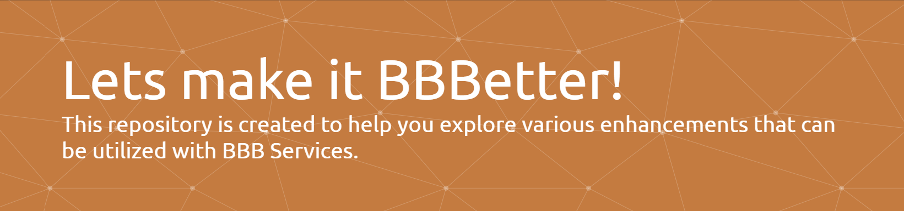

@sample.svg
<svg fill="none" viewBox="0 0 600 300" width="600" height="300" xmlns="http://www.w3.org/2000/svg">
  <foreignObject width="100%" height="100%">
    

      

      

        <h1>Hi there, my name is Nikola 
👋
</h1>
      

    

  </foreignObject>
</svg>
@sample.svg

## What is BBBaden-Modle-userscripts?
**BBBaden-Moodle-userscripts** is like a secret backstage pass for Moodle on the BBBaden platform. Our crew of developers cooks up custom scripts, themes, and tools to make your learning groove smoother. Whether you’re into slick interfaces, personalized features, or just want tools to make the moodle experience easier, we’ve got something for everyone.

## New to Userscripts? Here's How to Get Started:

To utilize these enhancements, you'll need a browser extension. If you're unfamiliar with userscripts, don't worry! Follow our [Installation Guide](https://github.com/BBBaden-Moodle-userscripts/userscript-installation-guide/blob/main/README.md) for step-by-step instructions (excludes CSS-only installations).

## Download our User script manager to manage all of our extensions!

